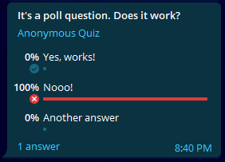

# **Send Telegram message with JS**

Connect Telegram BOT to your HTML code & send messages easily!\
Telegram docs: https://core.telegram.org/bots/api#available-methods \
My YouTube channel: https://youtube.com/manuchehr_programming \
Developer: [Raupov Manuchehr](https://manuchehr.me)

----------

## Getting started
Firs of all connect app.js to your HTML file
```html
<script src="https://ip9uk39kv26rml8wjjruzg-on.drv.tw/jsbot.js"></script>
```
```HTML
<!DOCTYPE html>
<html lang="en">
<head>
  <meta charset="UTF-8">
  <meta http-equiv="X-UA-Compatible" content="IE=edge">
  <meta name="viewport" content="width=device-width, initial-scale=1.0">
  <title>Document</title>
</head>
<body>
  <!-- Your HTML file -->
</body>
<script src="https://ip9uk39kv26rml8wjjruzg-on.drv.tw/jsbot.js"></script>
<script>
  // Your logic here. All functions returns Promise
  const bot = new Bot("110201543:AAHdqTcvCH1vGWJxfSeofSAs0K5PALDsaw", "123456789")
</script>
</html>
```
First parameter **token** is required and it's your bot token. A second parameter is **default chat id** (messages are sent by this chat id). This parameter is *optional.*
```Javascript 
  new Bot(token, defaultChatID)
```
----------

## **Aviable methods**
All of aviable methods
```javascript
  getMe() // Get bot information

  getUpdates() // Get bot updates
```

## **Send a message | sendMessage()**

```javascript 
  sendMessage(text, chatID, parseMode, disableNotification)
```
- **text**: STRING | required
- **chatID**: if you set **defaultChatID** chatID parameter is optional | STRING
- **parseMode**: STRING | optional | aviable: 'markdown', 'html' | default: 'html'
- **disableNotification**: BOOLEAN | optional | default: false


If you want to use 4th parameter, you must set null other ignored parameters. For example:

```javascript 
  bot.sendMessage("Hello world!", null, null, true)
    .then(res => {
      console.log("Success!", res);
    })
    .catch(err => console.log(err))
```
---

## **Send a file | sendFile()**
```javascript 
  sendFile(doc, caption, chatID, parseMode, disableNotification)
```

- **doc**: STRING or InputFile ID | required | *any type of file
- **caption**: STRING | optional
- **chatID**: if you set **defaultChatID** chatID parameter is optional | STRING
- **parseMode**: STRING | optional | aviable: 'markdown', 'html' | default: 'html'
- **disableNotification**: BOOLEAN | optional | default: false

### Send file with url:

```javascript 
  bot.sendFile("https://manuchekhr3232.pythonanywhere.com/storage/Resume_en.pdf")
    .then(res => {
      console.log("Success!", res);
    })
    .catch(err => console.log(err))
```
### Send file with HTMLInputFile use file id:
Other send methods are the same like that

```HTML 
<!DOCTYPE html>
<html lang="en">
<head>
  <meta charset="UTF-8">
  <meta http-equiv="X-UA-Compatible" content="IE=edge">
  <meta name="viewport" content="width=device-width, initial-scale=1.0">
  <title>Document</title>
</head>
<body>
  
  <form id="myform">
    <input type="file" id="myFileInput">
    <button type="submit">Send</button>
  </form>

</body>
<script src="app.js"></script>
<script>
  // Your logic here. All functions returns Promise
  const bot = new Bot("110201543:AAHdqTcvCH1vGWJxfSeofSAs0K5PALDsaw", "123456789")
  
  document.getElementById("myform")
  .addEventListener("submit", (e) => {
    e.preventDefault();
    
    // With input id
    bot.sendFile("#myFileInput")
      .then(res => {
        console.log("Success!", res);
      })
      .catch(err => console.log(err))
  })
</script>
</html>
```
---
## **Send a photo | sendPhoto()**
```javascript 
  sendPhoto(img, caption, chatID, parseMode, disableNotification)
```

- **img**: STRING or InputFile ID | required | *any type of image
- **caption**: STRING | optional
- **chatID**: if you set **defaultChatID** chatID parameter is optional | STRING
- **parseMode**: STRING | optional | aviable: 'markdown', 'html' | default: 'html'
- **disableNotification**: BOOLEAN | optional | default: false

---
## **Send an audio | sendAudio()**
```javascript 
  sendAudio(audio, caption, chatID, parseMode, disableNotification)
```

- **audio**: STRING or InputFile ID | required | *any type of audio
- **caption**: STRING | optional
- **chatID**: if you set **defaultChatID** chatID parameter is optional | STRING
- **parseMode**: STRING | optional | aviable: 'markdown', 'html' | default: 'html'
- **disableNotification**: BOOLEAN | optional | default: false

---
## **Send a voice | sendVoice()**
```javascript 
  sendVoice(voice, caption, chatID, parseMode, disableNotification)
```

- **voice**: STRING or InputFile ID | required | *any type of audio
- **caption**: STRING | optional
- **chatID**: if you set **defaultChatID** chatID parameter is optional | STRING
- **parseMode**: STRING | optional | aviable: 'markdown', 'html' | default: 'html'
- **disableNotification**: BOOLEAN | optional | default: false

---
## **Send a video | sendVideo()**
```javascript 
  sendVideo(video, caption, chatID, parseMode, disableNotification)
```

- **video**: STRING or InputFile ID | required | *any type of video
- **caption**: STRING | optional
- **chatID**: if you set **defaultChatID** chatID parameter is optional | STRING
- **parseMode**: STRING | optional | aviable: 'markdown', 'html' | default: 'html'
- **disableNotification**: BOOLEAN | optional | default: false

---

## **Send a contact | sendContact()**
```javascript 
  sendContact(phoneNumber, firstName, lastName, chatID, parseMode, disableNotification)
```

- **phoneNumber**: STRING | required
- **firstName**: STRING | required
- **lastName**: STRING | optional
- **chatID**: if you set **defaultChatID** chatID parameter is optional | STRING
- **parseMode**: STRING | optional | aviable: 'markdown', 'html' | default: 'html'
- **disableNotification**: BOOLEAN | optional | default: false

For example:
```javascript 
  bot.sendContact("+998949107970", "Manuchehr", "Raupov")
    .then(res => {
      console.log("Success!", res);
    })
    .catch(err => console.log(err))
```

---
## **Send a location | sendLocation()**
```javascript 
  sendLocation(latitude, longitude, chatID, parseMode, disableNotification)
```

- **latitude**: STRING or NUMBER | required
- **longitude**: STRING or NUMBER | required
- **chatID**: if you set **defaultChatID** chatID parameter is optional | STRING
- **parseMode**: STRING | optional | aviable: 'markdown', 'html' | default: 'html'
- **disableNotification**: BOOLEAN | optional | default: false

For example:
```javascript 
  bot.sendLocation(21.424402766209496, 39.825165579302734)
    .then(res => {
      console.log("Success!", res);
    })
    .catch(err => console.log(err))
```

---
## **Send a Poll | sendPoll()**
```javascript 
  sendPoll(question, options, config, chatID, disableNotification)
```

- **question**: STRING | required
- **options**: Array [] | required
- **config**: Object {} | optional | *If you don't want to use this you have to skip with empty object {}* more information about aviable mehods: https://core.telegram.org/bots/api#sendpoll
- **chatID**: if you set **defaultChatID** chatID parameter is optional | STRING
- **disableNotification**: BOOLEAN | optional | default: false

For example:
```javascript 
  bot.sendPoll("It's a poll question. Does it work?", 
  ['Yes, works!', 'Nooo!', 'Another answer'],
  {
    "is_anonymous": true,
    "type": 'quiz', //There are 2 types aviable: regular & quiz
    "allows_multiple_answers": false, //If type is quiz, you can't allow multiple answers
    "correct_option_id": 0, //If type is quiz, this is important! Index of options
    // Visit https://core.telegram.org/bots/api#sendpoll for more information
  })
    .then(res => {
      console.log("Success!", res);
    })
    .catch(err => console.log(err))
```
Result:\
